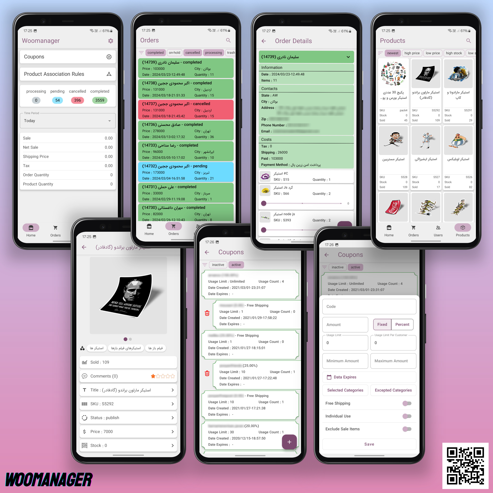

<!DOCTYPE html>
<html lang="en">
<head>
  <meta charset="UTF-8" />
  <meta name="viewport" content="width=device-width, initial-scale=1.0" />
</head>
<body>

<header>
  <h1>WooManager</h1>
  
Modern Android app to manage your WooCommerce store effortlessly.

</header>

<section>
  <h2>📱 About the App</h2>
  
WooManager helps you manage your WooCommerce store directly from your Android device. Whether you're checking stock, managing orders, or browsing product details — it's all in your pocket.

</section>

<section>
  <h2>📸 App Preview</h2>
  
</section>

<section class="features">
  <h3>🔥 Key Features</h3>
  <ul>
    <li>View & manage products, orders, customers and coupons</li>
    <li>Real-time data sync via RESTful API</li>
    <li>Offline support using Room Database</li>
    <li>Sleek UI with Jetpack Compose</li>
  </ul>
</section>

<section class="tech">
  <h3>⚙️ Tech Stack</h3>
  <ul>
    <li>Jetpack Compose (UI)</li>
    <li>Room</li>
    <li>Dagger (Dependency Injection)</li>
    <li>RESTful API integration (WooCommerce)</li>
    <li>MVVM Architecture</li>
  </ul>
</section>

<section>
  <h2>👨‍💻 About Me</h2>
  
I’m a passionate Android developer focused on clean code, performance, and great user experiences. WooManager is a reflection of my skillset and attention to detail.

  

    <strong>Let's connect:</strong> 
    <a href="mailto:sepehr.mzn@gmail.com">Email</a>
  

</section>

<footer>
  &copy; 2025 WooManager by Sepehr
</footer>

</body>
</html>
